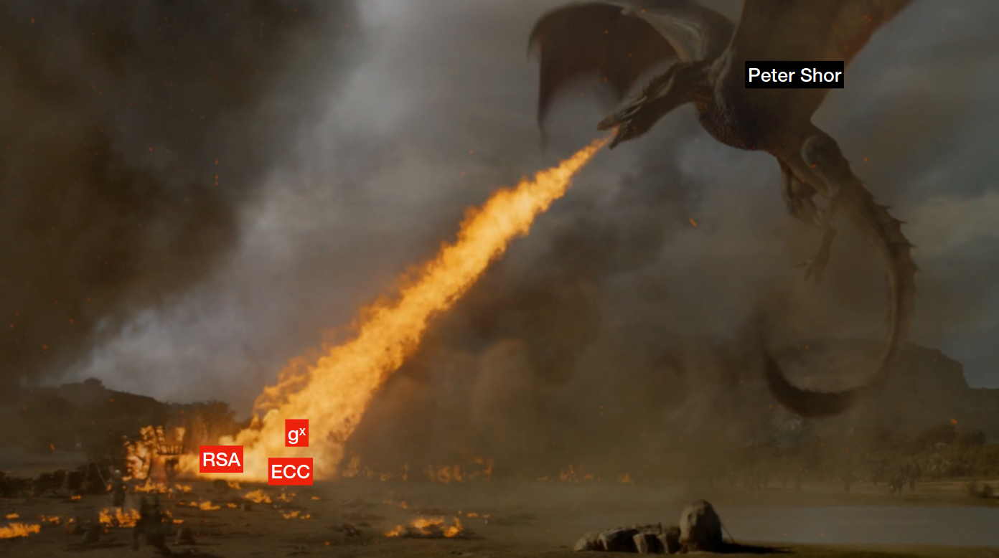
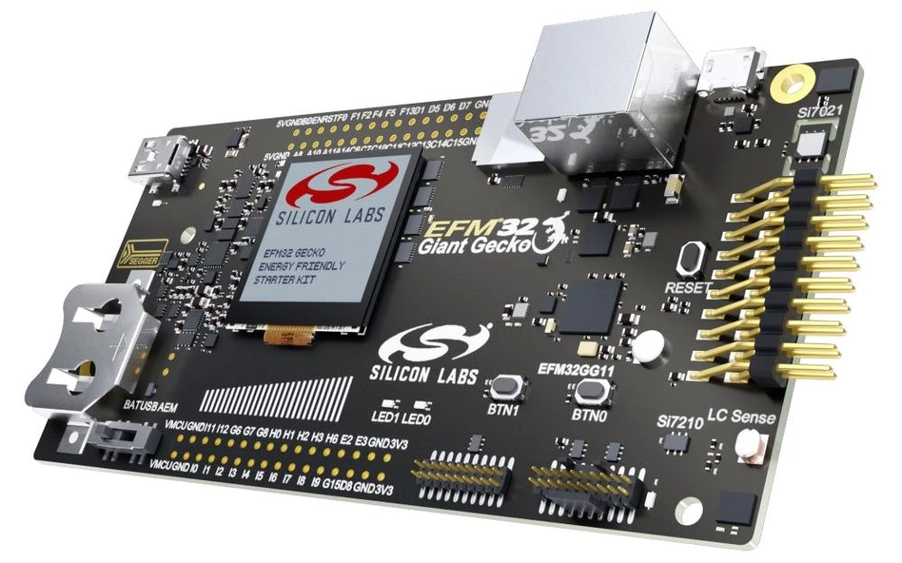
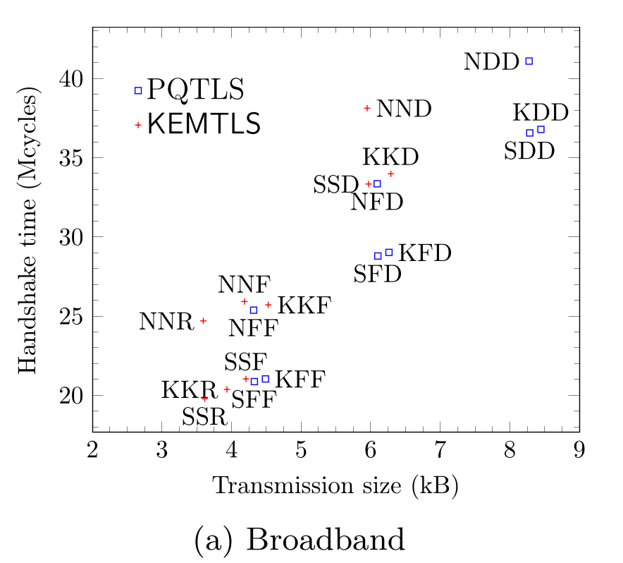
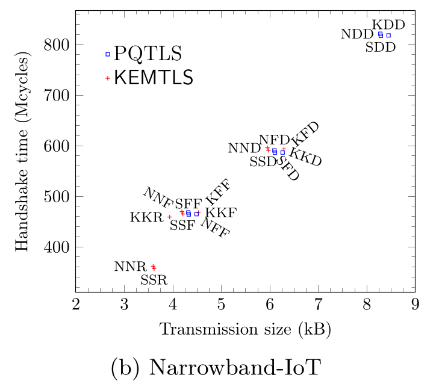

<section>
  <h2 class="r-fit-text">KEMTLS vs. Post-Quantum TLS</h2>
  <h3 class="r-fit-text">Performance on embedded systems</h3>

  Ruben Gonzalez and <strong>me</strong>
</section>

<section>
  <section>
    <h2>Post-Quantum</h2>
  </section>
  <section>
    
  </section>
  <section>
    <h2>Quantum attacks on cryptography</h2>
    <ul>
      <li>Quantum computers are not generally faster</li>
      <li>Shor's Algorithm specifically efficiently solves factoring and discrete log problems</li>
      <li>Need new cryptographic primitives to replace them</li>
    </ul>
  </section>
  <section>
    <h2>NIST PQC competition</h2>
    

      

        <h3>Key Exchange</h3>
        <ul>
          <li>Kyber ⭐</li>
          <li>SABER</li>
          <li>NTRU</li>
        </ul>
      

      

        <h3>Signatures</h3>
        <ul>
          <li>Dilithium ⭐⭐</li>
          <li>Falcon ⭐</li>
          <li>Rainbow 🪦</li>
          <li style="color: grey">SPHINCS+ ⭐</li>
        </ul>
      

    

  </section>
  <section>
    <h2>KEM key exchange</h2>
      

        sequenceDiagram
          Alice->>Bob: public key
          Note right of Bob: shared secret, ciphertext = KEM.Encapsulate(pk)
          Bob->>Alice: ciphertext
          Note Left of Alice: shared secret = KEM.Decapsulate(sk, ct)
          Note over Alice, Bob: encrypt traffic with shared secret
      

  </section>
  <section>
    <h2>Tradeoffs</h2>
    

      

        <h3>KEMs</h3>
        <ul>
          <li>Fast</li>
          <li>Smallish</li>
        </ul>
      

      

        <h3>Signatures</h3>
        <ul>
          <li><strong>Dilithium</strong>: huge pk, signature</li>
          <li><strong>Falcon</strong>: FPU usage in signing</li>
          <li><strong>Rainbow</strong>: enormous public key, tiny signature</li>
        </ul>
      

    

  </section>

  <section>
    
Q: how can we best use these tradeoffs?

  </section>
</section>

<section>
  <section>
    <h2>Post-Quantum TLS</h2>

    

      

        

        sequenceDiagram
          Client->>+Server: ClientHello: ephemeral kex
          Server->>-Client: ServerHello: ephemeral kex
          rect rgba(0,0,0,0)
            Server->>Client: Certificate: static signing pk
            Server->>Client: Signature
          end
          Server->>Client: ServerFinished
          rect rgba(0, 0, 0, 0)
            Server-->>Client: Application Data
          end
          Client->>Server: ClientFinished
          Client-->>Server: Application Data
        

        

          sequenceDiagram
            Client->>+Server: ClientHello: ephemeral kex
            Server->>-Client: ServerHello: ephemeral kex
            rect rgba(2, 100, 2, 0.3)
              Server->>Client: Certificate: static signing pk
              Server->>Client: Signature
            end
            Server->>Client: ServerFinished
            rect rgba(0, 0, 0, 0)
              Server-->>Client: Application Data
            end
            Client->>Server: ClientFinished
            Client-->>Server: Application Data
          

          

            sequenceDiagram
              Client->>+Server: ClientHello: ephemeral kex
              Server->>-Client: ServerHello: ephemeral kex
              rect rgba(0, 0, 0, 0)
                Server->>Client: Certificate: static signing pk
                Server->>Client: Signature
              end
              Server->>Client: ServerFinished
              rect pink
                Server-->>Client: Application Data
              end
              Client->>Server: ClientFinished
              Client-->>Server: Application Data
            

      

      

        <ul>
          <li>Ephemeral KEM key exchange</li>
          <li>Signature public key in certificate</li>
          <li>Server can send data immediately</li>
        </ul>
      

    

  </section>
  <section>
    <h2>KEMTLS</h2>

    

      

        

        sequenceDiagram
          Client->>+Server: ClientHello: ephemeral kex
          Server->>-Client: ServerHello: ephemeral kex
          rect rgba(0,0,0,0)
          Server->>+Client: Certificate: static KEM pk
          Client->>-Server: Ciphertext
          end
          Client->>Server: ClientFinished
          rect rgba(0, 0, 0, 0)
            Client-->>Server: Application Data
          end
          Server->>Client: ServerFinished
          Server-->>Client: Application Data
        

        

          sequenceDiagram
            Client->>+Server: ClientHello: ephemeral kex
            Server->>-Client: ServerHello: ephemeral kex
            rect rgba(2, 100, 2, 0.3)
              Server->>+Client: Certificate: static KEM pk
              Client->>-Server: Ciphertext
            end
            Client->>Server: ClientFinished
            rect rgba(0,0,0,0)
              Client-->>Server: Application Data
            end
            Server->>Client: ServerFinished
            Server-->>Client: Application Data
        

        

        sequenceDiagram
          Client->>+Server: ClientHello: ephemeral kex
          Server->>-Client: ServerHello: ephemeral kex
          rect rgba(0, 0, 0, 0)
            Server->>+Client: Certificate: static KEM pk
            Client->>-Server: Ciphertext
          end
          Client->>Server: ClientFinished
          rect pink
            Client-->>Server: Application Data
          end
          Server->>Client: ServerFinished
          Server-->>Client: Application Data
        

      

      

        <ul>
          <li>Ephemeral KEM key exchange</li>
          <li>KEM public key in certificate</li>
          <li>Avoid extra round-trip by letting client send data immediately</li>
        </ul>
      

    

  </section>

  <section>
    <h3>Existing work:</h3>
    <ul>
      <li>Server-only and client authentication</li>
      <li>Proofs, Tamarin analysis</li>
      <li>Variant with pre-distributed keys</li>
      <li><strong>Benchmarks using large-scale computers</strong></li>
    </ul>
  </section>
</section>

<section>
  <section>
    <h3>Embedded devices</h3>
    
  </section>
  <section>
    <h3>Silicon Labs STK3701A "Giant Gecko"</h3>
    <table>
      <thead></thead>
      <tbody>
        <tr>
          <th>CPU</th>
          <td>72 MHz Cortex-M4F</td>
        </tr>
        <tr>
          <th>FPU</th>
          <td>✅</td>
        </tr>
        <tr>
          <th>Flash</th>
          <td>2 MB</td>
        </tr>
        <tr>
          <th>SRAM</th>
          <td>512 kB</td>
        </tr>
        <tr>
          <th>Giant?</th>
          <td>Definitely.</td>
        </tr>
      </tbody>
    </table>
  </section>

  <section>
    <h3>The network</h3>
    <table>
      <thead>
        <tr>
          <th>Abbrev.</th>
          <th>Protocol</th>
          <th>Link speed</th>
          <th style="width: 20%">RTT</th>
        </tr>
      </thead>
      <tbody>
        <tr>
          <td>BB</td>
          <td>Broadband</td>
          <td>1 Mbit</td>
          <td>26 ms</td>
        </tr>
        <tr>
          <td>LTE-M</td>
          <td>LTE Machine Type Communication</td>
          <td>1 Mbit</td>
          <td>120 ms</td>
        </tr>
        <tr>
          <td>NB-IoT</td>
          <td>Narrowband IoT</td>
          <td>46 kbit</td>
          <td>3 s</td>
        </tr>
      </tbody>
    </table>
  </section>
</section>

<section>
  <h2>Implementation</h2>
  <ul>
    <li>WolfSSL client on Giant Gecko</li>
    <li>Rustls server on desktop computer</li>
    <li>Ethernet connection</li>
    <li>Apache Zephyr RTOS</li>
  </ul>
</section>

<section>
  <section>
    <h3>Results</h3>
  </section>
  <section>
    <h2>Code size results</h2>
    <ul>
      <li>Both KEMTLS and PQTLS need key exchange and signature verification code</li>
      <ul class="fragment"><li>(KEM)TLS clients do not need signing code</li></ul>
      <li class="fragment">Large differences in sizes of necessary certificate authority (CA) public keys: KEMTLS certs slightly smaller</li>
      <li class="fragment">PQTLS mixed certificate chains require more code</li>
      <li class="fragment">KEMTLS peak memory usage is lower</li>
    </ul>
  </section>
  <section>
    <h2>Communication time</h2>
    <ul>
      <li><strong>KEMTLS</strong> handshake traffic generally much lower</li>
        <ul class="fragment">
          <li>KEMTLS: Kyber-Kyber-Dilithium: 6.3 kB</li>
          <li>PQTLS: Kyber-Dilithium-Dilithium: 8.4 kB</li>
        </ul>
      <li class="fragment">Less traffic = faster handshake on low-bandwidth connections</li>
      <li class="fragment">PQTLS with Falcon certificates still very fast</li>
      <ul class="fragment">
        <li>Falcon is very small</li>
        <li>Falcon verification very fast on Cortex-M4F</li>
        <li>Requires Falcon online signing on the server</li>
      </ul>
    </ul>
  </section>
  <section>
    
  </section>
  <section>
    
  </section>
</section>

<section>
  <section><h1>Wrap-up</h1></section>
  <section>
    <h3>KEMTLS vs. Post-Quantum TLS: performance on embedded systems</h3>

    

      

        <h3>Conclusions</h3>
        <ul>
          <li>KEMTLS saves bytes on the wire, which really matters</li>
          <li>Without client authentication no big code size differences</li>
          <li>Paper at <a href="https://kemtls.org">https://kemtls.org/</a>.</li>
        </ul>
      

      

        <h3>Future work</h3>
        <ul>
          <li>Client authentication</li>
          <li>KEMTLS with Pre-Distributed Key</li>
        </ul>
      

    

    
Thanks for your attention

    
🌐 <a href="https://ruben-gonzalez.de">ruben-gonzalez.de</a> · 🌐 <a href="https://thomwiggers.nl">thomwiggers.nl</a>

  </section>
</section>
